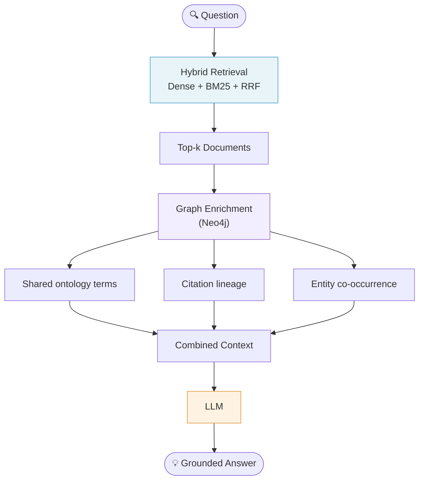

# GraphRAG: When Vectors Aren't Enough

*Qdrant tells you what's similar. Neo4j tells you what's connected. These are genuinely different things.*

Vector search finds documents near your query in embedding space. Graph traversal finds documents connected to your results through explicit relationships. A foundational paper might be semantically far from your query (it's about bacterial immune systems) but cited by every paper you retrieved (it invented CRISPR-Cas9). Vectors can't surface it. A citation graph can.

## What a Graph Adds

| Relationship | What it surfaces |
|---|---|
| `CITES` | Intellectual lineage — foundational work upstream |
| `HAS_MESH_TERM` | Ontological siblings — same concept, different angle |
| `MENTIONED_IN` (gene/entity) | Co-occurrence — related entities across corpus |
| `WROTE` | Collaborator networks |

None of these are proximity in embedding space. They're structural relationships that exist independently of semantic similarity.

## The Full Pipeline



## Graph Schema

A minimal property graph for document retrieval:

**Nodes:** `Document`, `Author`, `OntologyTerm`, `Entity`

**Edges:**
- `(Document)-[:CITES]->(Document)`
- `(Document)-[:HAS_TERM]->(OntologyTerm)`
- `(Author)-[:WROTE]->(Document)`
- `(Entity)-[:MENTIONED_IN]->(Document)`

## Cypher Enrichment Example

Finding documents that share the most ontology terms with a retrieved document:

```cypher
MATCH (d1:Document {id: $doc_id})-[:HAS_TERM]->(t)<-[:HAS_TERM]-(d2:Document)
WHERE d1 <> d2 AND NOT d2.id IN $already_retrieved
WITH d2, COUNT(DISTINCT t) AS shared_terms
RETURN d2.id, d2.title, shared_terms
ORDER BY shared_terms DESC
LIMIT 5
```

## When to Add the Graph Layer

Add a graph when:
- Your domain has explicit relationships not captured in text (citations, regulatory supersession, entity co-occurrence)
- You need to surface foundational/upstream documents that may be semantically distant
- You need traversal ("what depends on this regulation?")

Don't add a graph if your retrieval problem is purely about semantic similarity and keyword precision — hybrid search solves that.

## Related

- [[hybrid-search|Hybrid Search: Dense + Sparse + RRF]]
- [[knowledge-graphs/context-graphs-hdc|Context Graphs and HDC]]
- [[knowledge-graphs/entity-resolution|Entity-Centric Learning and Resolution]]
